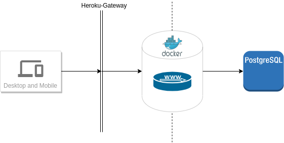

# rinnegan

- Staging [](https://gitlab.com/onlinejudge95/rinnegan/commits/staging)
- Production [](https://gitlab.com/onlinejudge95/rinnegan/commits/master)

## About

In compact form, rinnegan is sentiments as a service for an end user.
In today's world where **Sensationalism** is at an all time peak, it's really important for a user to know
what a collective group of people think about a particular _item/idea_.

Rinnegan tries to bridge the gap by providing a solution where a user can come and and search for sentiment of a keyword,
in a given timef rame from a limited sets of platforms.

## Architecture

The production system is hosted on heroku, we use containers for building and deploying the app.
Here is how our current architecture is.


## Development

1. Fork the repo.
2. Perform your changes.
3. Raise a PR for the same.
4. For contributions please lookout for [CONTRIBUTING](.github/CONTRIBUTING.md)

## Setup

Clone the repo using the following commands

```bash
$ git clone git@github.com:onlinejudge95/rinnegan.git
```

## Contact-Us

- [onlinejudge95](mailto:onlinejudge95@gmail.com)
